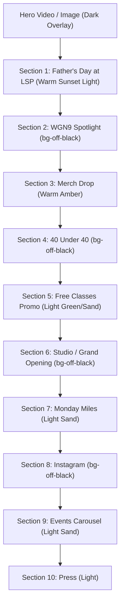
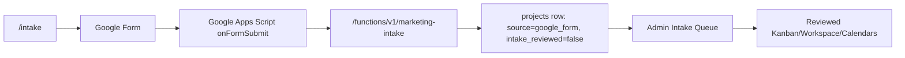
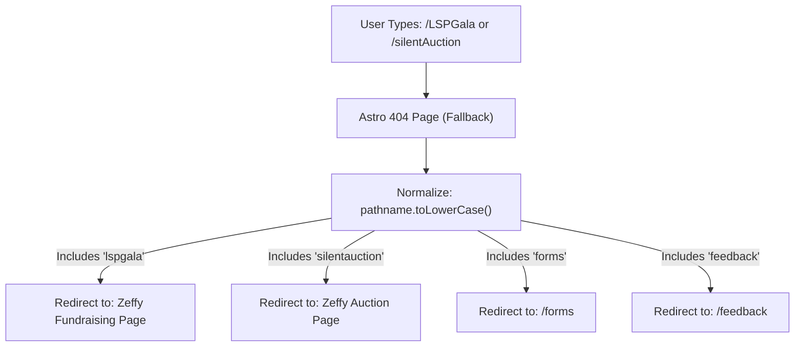

# The Latina Sweat Project — Comprehensive Design Language & Repository Handbook

Welcome to the comprehensive design and architectural handbook for **The Latina Sweat Project** (LSP). This document serves as the absolute single source of truth for the styling patterns, user experience standards, client-side interactions, and repository conventions across the entire digital presence of LSP. 

Use this handbook to maintain visual consistency, optimize mobile-first conversions, and ensure accessibility for every upcoming feature, page, and portal.

---

## 🎨 1. Core Visual Identity & Color System

LSP utilizes a warm, organic, yet highly vibrant color system that celebrates culture, wellness, and movement. The color system is designed to look premium and highly polished, using specific curated tones instead of standard browser colors.

### The Core Color Palette
| Color Token | Hex / Class | Ideal Use Case | Visual Tone |
| :--- | :--- | :--- | :--- |
| **Off-Black** | `#1e1e1e` / `bg-off-black` | Dominant text color, dark mode sections, primary buttons | Modern, grounding, premium |
| **Vibrant Pink** | `#b5a18d` / `text-vibrant-pink` | Primary brand accent, brand headers, active focus states, buttons | Warm, elegant, high-energy |
| **Accent Gold** | `#ffbd59` / `text-accent-gold` | Secondary accent, highlight text, run/miles club badges, warning borders | Energetic, sunny, inviting |
| **Kids Clay** | `#c7602d` | Youth and family event headings, badges, and CTAs | Playful, warm, legible over sand backgrounds |
| **Teal** | `text-teal-600` / `bg-teal-600` | Health & wellness collaborations, community safety events | Grounded, calm, medical-community trust |
| **Sky** | `text-sky-500` / `bg-sky-400` | Giving campaigns, donation cards, spring events | Fresh, airy, hopeful |
| **Natural Sand** | `#f5ede3` to `#e8d8c2` | Light section gradients, soft block backgrounds | Grounding, earthy, organic |

### Typography Guidelines
- **Primary Brand Headings**: Font family **Rubik** (or modern high-weight sans-serif like Outfit) with font weight `font-extrabold` or `font-bold` for large titles to create an impactful visual hierarchy.
- **Body Text**: Font family **Inter** or standard premium sans-serif `font-body` with `text-medium-gray` (`text-gray-500` or `text-white/70` in dark sections) to maintain superior readability.

---

## 🔄 2. The Alternating Section Background Pattern (`index.astro` & Shared Layouts)

To create a dynamic visual rhythm and keep users engaged, pages like `src/pages/index.astro` employ an alternating light-and-dark section design pattern. 



> [!NOTE]
> **June 2026 reorder.** Pride in the Park (Jun 14) and Kids Day (Jun 14) were removed once they passed, and Father's Day at LSP (Jun 21) was added as the lead spotlight after the hero. Removing the two events (one light, one dark) left a count of 6 light vs 4 dark full-width sections after the dark hero, so the lower page was reordered to keep strict light/dark alternation and the media-side zig-zag intact: WGN9, 40 Under 40, Grand Opening, and Instagram (all dark) now interleave the light sections, and 40 Under 40's flyer was flipped to the right (`md:flex-row-reverse`) to keep the L/R/L/R/L/R spotlight rhythm. With a dark hero plus 6 light / 4 dark sections, one same-theme adjacency is mathematically unavoidable; it is parked at the very bottom (Events Carousel light -> In The Press light), the least prominent junction. Resolve it for free whenever the next dark section is added near the bottom.

### Purpose & Rationale
1. **Visual Cadence**: Breaking up large pages into clear chapters prevents visual fatigue and facilitates scrolling.
2. **Contextual Themes**: The colors are matched to the content. High-energy activities (e.g. running club, active video) are grounded in **Dark** (`bg-off-black`), whereas education, donation, and health initiatives are presented in warm, inviting **Light** background systems.
3. **Optimized Readability**: Alternating layouts forces contrast resets, ensuring the eye is consistently re-focused on the next primary call to action (CTA).

### Standard Code Blueprint for Alternating Sections
When adding, removing, or reordering a section, recalculate the entire homepage sequence from the neighboring sections and restore the light/dark cadence before shipping. Identify whether the changed section belongs in a light or dark theme and use the established tailwind and decorative classes:

#### Option A: Dark Theme (Charcoal / Midnight)
```astro
<section class="relative overflow-hidden bg-off-black py-16 sm:py-20">
  <!-- Glowing Background Blurs to add depth -->
  <div class="absolute -top-32 -left-20 w-[400px] h-[400px] bg-vibrant-pink/15 rounded-full blur-[120px] pointer-events-none"></div>
  
  <div class="relative mx-auto max-w-7xl px-4 sm:px-6 lg:px-8 text-white">
    <!-- Section Content Here -->
  </div>
</section>
```

#### Option B: Warm Natural Theme (Light Sand)
```astro
<section class="relative overflow-hidden bg-gradient-to-br from-[#f5ede3] via-[#ece0cf] to-[#e8d8c2] py-16 sm:py-20">
  <!-- Soft Teal/Gold background blobs -->
  <div class="absolute -top-24 -right-24 w-[420px] h-[420px] bg-teal-300/25 rounded-full blur-[110px] pointer-events-none"></div>
  
  <div class="relative mx-auto max-w-7xl px-4 sm:px-6 lg:px-8 text-off-black">
    <!-- Section Content Here -->
  </div>
</section>
```

#### Option C: Youth / Family Event Theme
Use this for kid-focused community events that need to feel warm, legible, and playful without drifting into a one-note primary-color palette. The first implementation was **Kids Day at LSP / Día del Niño en LSP** (passed June 14, 2026, now removed from all placements); keep this pattern on hand for the next youth/family event.

On `src/pages/index.astro`, use the dark youth variant when the surrounding section rhythm needs a contrast reset:

```astro
<section class="relative overflow-hidden bg-off-black py-16 sm:py-20">
  <div class="absolute inset-0 opacity-[0.06]" style="background-image: linear-gradient(rgba(255,255,255,0.75) 2px, transparent 2px), linear-gradient(90deg, rgba(255,255,255,0.75) 2px, transparent 2px); background-size: 58px 58px;"></div>
  <div class="absolute inset-x-0 top-0 h-1 bg-gradient-to-r from-[#ff7a59] via-accent-gold to-cyan-400"></div>

  <div class="relative mx-auto max-w-7xl px-4 sm:px-6 lg:px-8 text-white">
    <!-- Flyer media + Kids Clay / Accent Gold content/CTA -->
  </div>
</section>
```

On the standalone events page, the lighter playful sand variant is acceptable because it opens after the events page header and before unrelated sections:

```astro
<section class="relative overflow-hidden bg-gradient-to-br from-[#fbf3ea] via-[#fff8ef] to-[#f4dfcf] py-16 sm:py-20">
  <div
    class="absolute inset-0 opacity-[0.2]"
    style="background-image: linear-gradient(rgba(255,255,255,0.75) 2px, transparent 2px), linear-gradient(90deg, rgba(255,255,255,0.75) 2px, transparent 2px); background-size: 58px 58px;"
  ></div>
  <div class="absolute inset-x-0 top-0 h-1 bg-gradient-to-r from-[#ff7a59] via-accent-gold to-cyan-400"></div>

  <div class="relative mx-auto max-w-7xl px-4 sm:px-6 lg:px-8">
    <!-- Flyer media + Kids Clay (#c7602d) content/CTA -->
  </div>
</section>
```

#### Option D: Celebration Event Theme (Pride)
Use this for celebration events where the event identity carries its own palette but the site still needs LSP's warm, premium look. This pattern was last carried by **Pride in the Park** (passed June 14, 2026, now removed from all placements; it had replaced the LSP World Cup Watch Party in the same slots). Keep it on hand for the next event that ships its own palette.

- On the homepage, place the celebration spotlight immediately after the hero as a **light** section with a 1px themed top strip so the sequence stays Hero dark overlay -> event light -> WGN dark.
- On the standalone events page, a richer dark variant of the event palette is acceptable because it opens after the light events header and before later sections. Give that section an `id` slug with `scroll-mt-28` so site banners can deep-link to it.
- Pair the lead palette color with white, accent gold, and supporting tones so the event does not become one-note; reserve full multi-color gradients for thin accents (top strips, badges).
- Copy the supplied portrait flyer into `public/images/` (e.g. `public/images/<event-slug>.png`) so the homepage, event cards, links page, and event detail page do not depend on a remote image request.
- Portrait event flyers should declare `imageFrameClass: "aspect-[4/5]"` and `imageClass: "h-full w-full object-contain"` in `src/data/events.js` so `/events/[slug]` displays the full flyer instead of cropping it into a landscape frame.
- On `src/pages/links.astro`, event cards may use an optional `image` / `imageAlt` thumbnail in place of the default icon when a current event has a strong flyer or campaign visual.

#### Option E: Warm Sunset Event Theme (Father's Day)
Use this warm-light variant of Option B for community-celebration classes that are booked through the studio scheduler (not Zeffy). The current implementation is **Father's Day at LSP** on `src/pages/index.astro`, `src/pages/events.astro`, `src/pages/links.astro`, and the homepage events carousel.

- On the homepage, place the spotlight immediately after the hero as the lead event, with the flyer on the **left** so it zig-zags with the WGN9 video on the right. Sunset gradient: `bg-gradient-to-br from-[#fdf3e7] via-white to-[#fbe7d2]` with an amber/gold top strip (`from-amber-500 via-accent-gold to-orange-400`), off-black text, and Kids Clay (`#c7602d`) accents.
- On the standalone events page, the same warm gradient opens after the light page header and before the dark Monday Miles section; the section carries `id="fathers-day-lsp"` with `scroll-mt-28`.
- CTAs route to the booking surfaces, not a ticketing page: a primary **Book Your Spot** button to `${base}schedule` plus secondary App Store / Google Play buttons.

### Alternating Media Sides on the Homepage
Beyond alternating section backgrounds, two-column event spotlights on `src/pages/index.astro` should also alternate which side the graphic/flyer sits on as the user scrolls. Consecutive spotlights must not stack their media on the same edge, because a repeated image-left, image-left rhythm reads as a rigid template and flattens the page. Letting the photo swing left, then right, then left creates a zig-zag reading path that keeps the eye moving and feels more intentionally designed.

Implementation notes:
- Use Tailwind `lg:order-*` utilities on the two grid children to control desktop placement rather than reordering the markup, so the natural DOM order (media first) is preserved for mobile and assistive tech.
- Keep the text column readable on the side it lands on by pairing `lg:text-left` / `lg:text-right` and `justify-center lg:justify-start` / `lg:justify-end` as needed.
- The Father's Day spotlight places its flyer on the **left** (copy on the right) so it zig-zags with the WGN9 video on the right directly below it.
- Current desktop media rhythm (left/right/left/right/left/right): Father's Day flyer on the left, WGN9 video on the right, merch tee on the left, 40 Under 40 photo on the right, Studio / Grand Opening image on the left, and Monday Miles visual on the right. (The Free Classes promo sits between 40 Under 40 and Grand Opening but is a two-card grid, not a media spotlight, so it does not affect the zig-zag.)

Event and section change checklist:
- Whenever an event is added, removed, expired, or promoted, update every affected placement in the same change: `src/pages/index.astro`, `src/pages/events.astro`, `src/pages/links.astro`, carousel cards, and `design.md` when applicable.
- After adding or removing any homepage section, re-audit the section background cadence so adjacent full-width sections do not accidentally share the same light or dark treatment unless the exception is intentional and documented here.
- After adding or removing any two-column homepage spotlight, re-audit the desktop media-side zig-zag and update `lg:order-*` classes as needed.
- When changing the homepage events carousel, keep each event card as a direct child of `#events-carousel` so the generated pagination dots stay in sync with the card count.

Father's Day at LSP functional contract:
- Booking: this is a studio class, not a Zeffy event. CTAs route to `${base}schedule` and to the LSP Studio app (iOS `https://apps.apple.com/us/app/lsp-studio/id6755971141`, Android `https://play.google.com/store/apps/details?id=com.marianatek.latinasweatproject&hl=en_US`). There is no ticketing URL.
- Event graphic: `public/images/fathers-day-lsp.png`, the supplied portrait flyer copied into the local public asset directory. (Add this file; the placements reference it and it is not committed yet.)
- Event date/time: Sunday, June 21, 2026, 10:30 AM. The class is **Father's Day Strength Training & Flow**. All levels welcome.
- Venue: LSP Studio, 949 W 16th St, Chicago.
- Required placements while upcoming: homepage spotlight after the hero (lead event, warm sunset light, flyer left), first homepage events carousel card, first `links` card, and the top featured section on `src/pages/events.astro` (with the `fathers-day-lsp` anchor id). It is a one-time class, so it is **not** added to `src/data/events.js` (that file backs evergreen `/events/[slug]` pages only).
- Tracking: the schedule CTA uses `class_booking_start` with `data-conversion-booking-path="schedule_page"`; the app buttons use `app_download_click` with `data-conversion-platform="ios"` / `"android"`. Context is `home_fathers_day` / `events_fathers_day`.
- The homepage should preserve the lower-page contrast sequence: Grand Opening dark, Monday Miles light, Instagram dark, Events carousel light, Press light (the carousel -> Press pair is the parked light/light junction noted above).

---

## 📱 3. The Linktree-esque Social Hub (`src/pages/links.astro`)

The Links page is a crucial portal, housed directly in LSP's social media bios (e.g., Instagram). It is designed to act as an immersive, mobile-first "Linktree" that drives immediate actions like class booking, event signups, and newsletters.

### Bilingual Integration & Content Architecture
All content (titles, descriptions, and badges) inside both the main `links` list and the `highlights` array supports nested `{ en, es }` localization objects.

#### Standard Operating Procedure for Adding New Links
To add, edit, or highlight links, modify the `links` array inside the frontmatter:

```typescript
// Location: src/pages/links.astro
const links = [
  {
    title: {
      en: "📢 Event or Page Title",
      es: "📢 Título del Evento o Página"
    },
    description: {
      en: "Detailed, brief 1-2 sentence description explaining the value proposition.",
      es: "Descripción breve de 1 o 2 oraciones que explique el valor del evento."
    },
    url: `${base}your-target-slug`, // Use base prefix for internal routes, or direct URL for external
    color: "teal", // Options: "teal" | "blue" | "sky" | "wish" | "green" | "indigo" | "amber" | "vibrant-pink" | "gold" | "pride"
    icon: "calendar", // Options: "calendar" | "heart" | "mind" | "globe" | "star" | "health" | "leaf" | "yoga" | "tv"
    badge: {
      en: "New / Date", // Optional: text string displaying on top-right badge
      es: "Nuevo / Fecha"
    },
    featured: true, // Optional: applies a glowing border, custom shadows, and elevated scaling
  }
];
```

> [!IMPORTANT]
> **The Chronological Ordering Rule:** 
> Links must always be ordered chronologically to ensure maximum community conversion:
> 1. **Upcoming Event/Campaign Links** (with active dates or deadlines) come FIRST.
> 2. **Recurring, Constant, or Undated Links** (e.g., Class Schedule, Main Website, App Downloads) come SECOND.
> 3. **Past Events** must be removed or moved to the bottom of the list.

Current active event link:
- **Father's Day at LSP / Día del Padre en LSP**: first featured card in `links`, pointing to the schedule page (`${base}schedule`) rather than a Zeffy ticketing URL, amber calendar styling with the `fathers-day-lsp.png` flyer thumbnail, badge `Jun 21 · 10:30 AM` / `21 Jun · 10:30 AM`. Tracking resolves automatically from the `/schedule` URL via the link helpers: `class_booking_start` with booking path `schedule_page` and provider `lsp_website`.

### Advanced Highlights & Interactive Systems
- **Liquid Glass Language Switcher**: A premium `EN | ES` toggle shifts a liquid glass background indicator dynamically. The toggle manages parent class bindings (`.lang-active-en` / `.lang-active-es`) that swap visible translations in CSS instantly with zero layout shift, and stores preferences in `localStorage`.
- **Branded Story Highlights Covers**: Uses custom, high-fidelity AI-generated covers stored in `public/images/highlights/hl_*.png` (Free Classes, WGN Feature, YTT, Therapy, App).
- **Bubble Sizing and Center Alignment**: 
  - To prevent sizing shifts and squeezing, bubble elements carry absolute sizes (`w-[66px] h-[66px] flex-shrink-0`).
  - The parent list `#highlights-bar` is aligned using `items-start` rather than centering. Since each bubble has identical sizing, **all bubble centers align perfectly horizontally**, regardless of whether their labels underneath span one or two lines.
  - Individual Highlight items apply tailored base scaling factors (`scale-[1.48]`, `scale-[1.38]`, etc.) to crop away any internal margins or outer borders embedded in the graphics, presenting a uniform visual appearance.
- **High-Momentum Direct Routing**: Clicking a Highlight Story bubble routes users directly to external links (e.g. Zeffy drives, REDCap surveys, or television subpages) in a new tab to maximize conversion. Multi-button hubs (Free Classes and App Download) scroll internally to the corresponding page section.
- **Tight Newsletter Spacing**: The embedded Zeffy iframe container `.newsletter-frame` is explicitly styled to `195px` tall to eliminate dead space at the bottom of the card and maintain a clean, compact appearance.
- **Animated Liquid Gradients**: The background is dynamically styled using the `.links-bg` class which rotates a multi-color gradient shifting over 12 seconds (`@keyframes links-gradient-shift`).
- **Floating Decorative Blobs**: Floating organic circles drift slowly in the background (`links-blob-1`, `2`, and `3`) using independent CSS `@keyframes` floats, giving a highly premium, alive feel.
- **Main Hero Promotion (Double Schedule Block)**: Highly prominent free class campaign section split between Pilsen studio (directing users to the schedule page/app) and Southside Social (directing users to Zeffy) to capitalize on immediate conversions.
- **App Download Center**: Clean, branded Google Play and Apple App Store CTA buttons embedded at the bottom using platform SVG logos.
- **Zeffy Newsletter Integration**: Seamlessly embeds the Zeffy sign-up form via a custom styled `iframe` to keep users on-site while gathering contacts.

---

## 🧘‍♀️ 4. The Reels-Style Video Portal (`src/pages/2025ytt.astro`)

The **2025 Yoga Teacher Training (YTT) Cohort page** is a visual showcase that celebrates LSP's certified yoga instructors. It implements a premium, high-fidelity experience optimized for mobile screens, matching the layout language of vertical video platforms (Instagram Reels / TikTok).

### Key Architectural Pillars of the YTT Portal
1. **Interactive Glass Search & Sticky Filters (`.ytt-filterwrap`)**:
   - The filter wrapper remains stuck to the top of the viewport (`position: sticky; top: 0.75rem`).
   - Uses `backdrop-filter: saturate(170%) blur(20px)` and high-contrast translucent borders (`border: 1px solid rgba(255, 255, 255, 0.8)`) to maintain legible content underneath.
   - Search bar input with custom vector search icon and responsive focus shadow (`box-shadow: inset 0 0 0 2px var(--lsp-gold)`).
   - Responsive pill slider: On small mobile screens, the category pills slide horizontally (`overflow-x: auto; scrollbar-width: none`) without clutter, and expand on larger desktop grids.
2. **Reels-Aspect Video Cards (`.ytt-grid` & `.ytt-card`)**:
   - A grid layout that scales seamlessly from 2 columns on mobile devices up to 5 columns on wide desktops.
   - The `.ytt-card` container uses a strict vertical aspect ratio (`aspect-ratio: 9 / 16`) with linear gradients overlaying high-quality thumbnails.
   - **Performance-tuned Loading Animation**: When filters are changed, the cards rise sequentially into view using index-staggered delays (`card.style.animationDelay = ...` mapped to `@keyframes yttRise` translating along the Y-axis).
   - On hover, cards scale outwards (`transform: scale(1.06)`) and expand a custom play overlay button (`.ytt-play`) with glowing shadow indicators.

```
+------------------------------------+
|  [Close]                  [NavUp]  |
|                                    |
|   +----------------------------+   |
|   |   YouTube Programmatic     |   |
|   |         Player             |   |
|   |      (Locked Frame)        |   |
|   |                            |   |
|   |  [Invisible Drag Overlay]  |   |
|   +----------------------------+   |
|                                    |
|   Kayla - Pigeon Pose     [NavDown]|
|   [Swipe up for next]              |
+------------------------------------+
```

3. **Reels-Style Swipe Navigation Lightbox Modal**:
   - Tapping any card opens a full-screen vertical swipe modal (`#ytt-modal`) displaying ~1 minute clips of instructors teaching a pose.
   - **Programmatic YouTube IFrame API**: Programme-controlled player wrapper (`initPlayer`) that handles automatic video playing, destroys old frames instantly, and guarantees that audio stops playing as soon as a user swipes away or closes the modal.
   - **Invisible Drag Overlay (`.ytt-drag-overlay`)**: Positioned directly over the video player frame to intercept mouse drags and touch gestures. This is a critical hack that prevents standard YouTube iframe frames from swallowing touch gestures.
   - **Vertical Swipe/Drag Gesture Track**:
     - Standardizes horizontal locks: Swiping upward loads the next instructor, swiping downward loads the previous instructor, and dragging moves the entire viewport track (`#ytt-modal-track`).
     - Includes a glowing vertical bounce swipe hint overlay (`.ytt-swipe-hint` with `@keyframes yttHintBounce` reading "Swipe for next") that instructs mobile users.
     - **Parent Scroll-Freeze Prevention**: When the modal is open, the page captures the viewport offset (`savedScrollY = window.scrollY`) and applies a locked scroll-freeze state (`body.ytt-modal-open` setting `position: fixed; width: 100%; overflow: hidden`) to prevent background layout shifting. On close, it restores coordinates.

---

## 📊 5. Instagram Stories "Wrapped" Component (`src/pages/wrapped.astro`)

The **2025 Wrapped** page presents a high-impact, story-style retrospective of the year's milestones. It replicates the interaction patterns of Instagram Stories, offering a highly native mobile experience even inside desktop web browsers.

### Key UX Design Features
1. **Mock Phone Viewport Frame**:
   - On mobile viewports, the stories occupy `100vw` and `100vh` for complete immersion.
   - On desktop displays, the player renders a centered mock iPhone enclosure (`w-full h-full lg:w-[375px] lg:h-[812px] lg:max-h-[90vh] lg:rounded-3xl lg:shadow-2xl`) floating over a blurred, scaled-up backdrop of the active slide (`#blurred-bg img` with `blur-3xl scale-110 opacity-50`).
2. **Visual Progress Indicators**:
   - A row of horizontal lines at the top of the container (`#progress-container`), one for each slide.
   - An active progress bar slowly fills over time (`SLIDE_DURATION = 5500` ms) using a CSS `transition-all duration-100` setting width percentages.
   - Fully loaded slides remain at `100%` width, and future slides sit at `0%` width, enabling instant progress scanning.
3. **Tap and Long-Press Gesture Controls**:
   - **Left/Right Tap Zones**: The left 1/3 of the viewport (`#tap-left`) triggers the previous slide, and the right 2/3 (`#tap-right`) triggers the next slide.
   - **Long-Press to Pause**: Holding down a tap zone (`HOLD_THRESHOLD = 200` ms) pauses slide playback and progress bars, and displays a semi-translucent overlay (`#paused-indicator`). Releasing the pointer resumes the experience.

```
       Tap Left (1/3)                Tap Right (2/3)
+-----------------------+---------------------------------------+
|  [Bar 1] [Bar 2] [Bar 3 (Active Progress)] [Bar 4] [Bar 5]    |
|                                                               |
|  <- Swipe/Tap Left                  Swipe/Tap Right ->        |
|  (Previous Slide)                    (Next Slide)             |
|                                                               |
|                        [Hold to Pause]                        |
|                                                               |
+---------------------------------------------------------------+
```

4. **Swipe-Down-to-Close Gesture**:
   - Dragging or swiping downwards anywhere inside the container triggers a native "Swipe to dismiss" action.
   - Using pointer-coordinates, dragging scales the card down (`1 - progress * 0.1`) and reduces opacity (`1 - progress * 0.5`).
   - Dragging past the threshold (`SWIPE_THRESHOLD = 100` px) triggers a slide-down animation (`translateY(100vh)`) and navigates the user back to their previous page, replicating mobile app behaviors.
   - *Note: This gesture is programmatically disabled on the final slide to prevent conflicts with the CTA buttons.*

---

## 🗓️ 6. Dynamic Scheduler & Location Spotlight System (`src/pages/schedule.astro` & `classes.astro`)

The class schedule page is the transactional powerhouse of the site, handling user registrations and booking workflows through MarianaTek integrations.

### Key Visual & Functional Standards
1. **Compact Policy Warning Strip**:
   - Renders a responsive 3-column alert row isolated at the very top of the page:
     - **Age Policy Card (`bg-red-50/70 border-red-200`)**: Standard circular badge (`12+`) enforcing safety registration limits.
     - **Lockout Policy Card (`bg-rose-50/70 border-vibrant-pink/30`)**: Strict notice that doors close exactly 5 minutes after class begins, linking directly to the full late policy (`/latepolicy`).
     - **Cancellation Policy Card (`bg-amber-50/70 border-accent-gold/40`)**: Explicit guidelines detailing email requirements and 30-day billing cycle parameters.
2. **MarianaTek Widget Top Spacing Compensation**:
   - The embedded MarianaTek schedule widget renders native top-padding inside iframe frames that can't be easily overwritten by utility classes.
   - **Architectural Solution**: Wrap the mounting `div` in the custom `.schedule-widget-tight` class, applying a negative margin `margin-top: -0.5rem` and stripping margin/padding child elements to force the widget closer to the troubleshooting menu.
3. **Bilateral Free Class Showcase System**:
   - Renders a visually stunning comparison layout highlighting LSP's community collaborations across two main locations:
     - **Location A (Pilsen LSP Studio)**: Highlights free day rotations, integrates mobile app store download buttons, and displays active class dates.
     - **Location B (Back of the Yards Southside Social)**: Displays the static weekly instructor schedules and provides clear exit CTAs pointing directly to the Zeffy ticketing page.

```
                 Current Real-Time Client Date: May 18, 2026
                                      |
       Pilsen Grid dates:             v             BOTY Grid dates:
+----------------------------+                 +----------------------------+
| [Fri 1] (Past -> Dimmed)   |                 | [Sat 9] (Past -> Dimmed)   |
| [Sat 9] (Past -> Dimmed)   |                 | [Sun 10] (Past -> Dimmed)  |
| [Sun 17] (Past -> Dimmed)  |                 | [Sat 16] (Past -> Dimmed)  |
|                            |                 |                            |
| [Mon 25] <--- ACTIVE NEXT  |                 | [Sat 23] <--- ACTIVE NEXT  |
|              (Glows Gold)  |                 |             (Glows Emerald)|
|                            |                 |                            |
| [Tue 2]  (Future -> Clean) |                 | [Sun 24] (Future -> Clean) |
+----------------------------+                 +----------------------------+
```

4. **Dynamic Real-Time "NEXT" Class Highlighting Script**:
   - Displays calendar dates in static HTML grids. To keep these dates from feeling stale, a client-side JavaScript engine executes instantly upon loading.
   - **The Highlight Logic**: 
     - Parses the current calendar date (`new Date()`) and normalizes it to a `YYYY-MM-DD` string.
     - Groups elements carrying `data-free-date` and `data-free-loc` attributes.
     - Sorts each group chronologically, compares strings against `todayStr`, and tags the *very first* event that is equal to or greater than the current date with the `data-free-next="true"` attribute.
     - **High-contrast CSS Styles**: Elements matching `data-free-next="true"` automatically display a styled `↓ NEXT` label badge and animate a glowing ambient pulse shadow (`@keyframes sched-pulse-gold` and `@keyframes sched-pulse-emerald`), instantly guiding the user to the next upcoming free class.

---

## 💬 7. Bilingual Collapsible Accordion System (`src/pages/faq.astro`)

The FAQ page handles core membership, cost, and logistics questions in a highly visual, fully translation-friendly bilingual layout.

### Layout & Sizing Standards
1. **Bilingual Side-by-Side Cards**:
   - The mission introduction displays a dual grid: "Hecha por Latinas" (English column) and "Para Nuestra Comunidad" (Spanish column).
   - Styled with soft background translucency (`bg-white/[0.04] backdrop-blur-sm`) and thin top-border linear highlights (`bg-gradient-to-r from-transparent via-accent-gold/pink to-transparent`) to establish immediate brand warmth.
2. **Smooth Height-Expanding Accordion (`.faq-item`)**:
   - Accordion answers utilize a strict `overflow: hidden; max-height: 0; transition: max-height 0.4s cubic-bezier(0.4, 0, 0.2, 1)` standard.
   - When a user toggles a question, the class `.open` is appended, expanding `max-height` smoothly to `600px` and rotating the vector chevron toggle icon (`.faq-chevron`).
   - The client-side script enforces a **Single-Open Rule**: Toggling any new FAQ immediately sweeps the list and closes all other open cards to keep scroll offsets compact. The first FAQ card is set to `.open` by default upon page initialization.
3. **Bilingual Inline Tab Switcher**:
   - Each FAQ item contains individual inline language switchers (`.lang-btn`).
   - Tapping "Español" dynamically hides the English div (`.lang-en`) and displays the Spanish div (`.lang-es`) by toggling the Tailwind `.hidden` utility class via client-side JS selectors. This allows multilingual users to read answers in their preferred language without forcing a heavy global page reload.

---

## 📈 8. Live Event Fundraising Dashboard (`src/pages/gala/live.astro` & `gala.astro`)

For fundraisers and gala events, LSP utilizes an immersive, high-contrast live visual theater designed to be displayed on stage projectors or primary event monitors.

### Aesthetic Elements & Layout
- **Strict Viewport Containment**: Renders using `lg:h-screen lg:overflow-hidden bg-off-black`, keeping all crucial components visible on the main stage screen without generating a vertical scrollbar.
- **Top 10% / Middle 80% / Bottom 10% Division**:
  - **Header (10% h)**: Sleek, narrow border container displaying the branding logo and the event title "Noche Inolvidable" in wide uppercase typography.
  - **Main Stage (80% h)**: Splits down the middle on desktop screens:
    - **Left Column**: Displays a reactive live Svelte thermometer widget (`Thermometer client:only="svelte"`) mapping fundraising progress, and a real-time leaderboard listing top donation names (`TopDonors`).
    - **Right Column**: Centers a large, glowing fundraising QR code (`galaqr.png`) encased inside a thick, multi-color pulsing neon shadow block (`animate-pulse blur-lg bg-gradient-to-r from-vibrant-pink via-accent-gold to-vibrant-pink`).
  - **Footer Ticker (10% h)**: Stays fixed at the bottom edge (`fixed bottom-0 left-0 right-0`), running a horizontal reactive donation marquee loop (`DonationTicker`) and generating slide-up overlay cards (`DonationPopup`) whenever a new Zeffy donation is completed.

```
+---------------------------------------------------------------+
|                      Header (Logo & Title)                    |
+-------------------------------+-------------------------------+
|                               |                               |
|        Left Column:           |         Right Column:         |
|                               |                               |
|     [Svelte progress          |     [Pulsing Glow QR Code]    |
|       thermometer]            |           "Scan Me"           |
|                               |                               |
|     [Live Donor Standings]    |      latinasweatproject.com   |
|                               |                               |
+-------------------------------+-------------------------------+
|                      Footer Donation Ticker                   |
+---------------------------------------------------------------+
```

- **GPU-Accelerated Floating Particles System**:
  - Creates a three-dimensional depth effect using two distinct particle keyframe sets:
    - **Gold Particles (`.particle-gold`)**: Move vertically from the bottom of the screen (`transform: translateY(100vh) scale(0)`) up to the top using a linear keyframe path (`@keyframes float-up`).
    - **Pink Particles (`.particle-pink`)**: Drift diagonally across the canvas using a secondary coordinate path (`@keyframes float-diagonal`).
  - **Performance Optimization**: Particles are isolated using `pointer-events-none z-0` and are programmatically hidden on narrow mobile devices (`hidden lg:block`) to prevent CPU bottlenecks on mobile viewports.
  - **Soft Ambient Pulsing**: Slow-moving radial gradients (`ambient-glow`) slowly pulse in scale and opacity in the background over 8 seconds (`@keyframes ambient-pulse`) to create a warm, alive backdrop without distracting from the text.

---

## 🤝 9. Svelte Portals & Policy Notice Frameworks (`shifts.astro`, `subs.astro`, `discountmembership.astro`, `elections.astro`)

For public community portals that handle volunteer shifts, teacher sub-requests, sliding scale packages, and board elections, LSP employs a hybrid architecture: fast Astro layout frames wrapping reactive, client-mounted Svelte engines.

### Policy Notice Standards
To establish immediate community boundaries, reduce administrative friction, and handle known browser bugs, all interactive portals must mount warning grids using these three standardized card styles:

```
+-----------------------------------------------------------------+
|  [Known iOS Safari Warning] - bg-red-50 border-red-200          |
|  - Advises users of viewport issues, requests desktop switch   |
+-----------------------------------------------------------------+
|  [Children Safety Policy] - bg-amber-50 border-amber-200        |
|  - Warns volunteers not to bring kids to shifts for safety     |
+-----------------------------------------------------------------+
|  [Process/Checklist Rules] - bg-blue-50 border-blue-200          |
|  - Outlines consecutive hour tracking and lead check-in rules   |
+-----------------------------------------------------------------+
```

1. **Option A: Known iOS Safari Warning (`bg-red-50 border-red-200 text-red-800`)**:
   - Enforces a critical warning to prevent mobile layout errors on iPhone devices, prompting users to switch to "Desktop View" or use a computer.
2. **Option B: Children Safety Notice (`bg-amber-50 border-amber-200 text-amber-800`)**:
   - Important mutual-aid safety card advising volunteers that bringing children to shifts is strictly prohibited for focus and liability reasons.
3. **Option C: Process / Checklist Rules (`bg-blue-50 border-blue-200 text-blue-800`)**:
   - Helpful guide detailing consecutive hours, checkout requirements, and maximum daily hour limits before Svelte forms initialize.
4. **Candidate Speeches & Modals Grid (`elections.astro`)**:
   - Features standard congratulatory banners coupled with embedded YouTube recordings of candidate speeches.
   - Loops candidate data arrays to render the custom `<CandidateCard />` grid, displaying detailed bios, images, and card story modals.

---

## 🔒 10. Admin Dashboard Blueprint & Security Guidelines

LSP now has two categories of administrative surfaces:

1. **Legacy lightweight admin utilities** for narrow internal workflows such as volunteer audits, gala ticket checks, and one-off operational tools.
2. **The Marketing Management Suite** at `/admin/marketing`, a full Supabase-backed collaborative workspace for the Brand & Visibility team.

Future internal tools should choose the architecture that matches their risk profile. Anything that stores team accounts, project data, assignment history, approvals, or campaign delivery information must follow the Supabase-backed marketing dashboard pattern rather than the older client-side password gate.

### Legacy Astro-Svelte Admin Utility Pattern
Older admin pages live under `/src/pages/admin/` or as `*admin.astro` pages. They mount Svelte in client-only mode and may include a lightweight session-storage gate for low-risk operational screens.

```astro
<Layout title="Volunteer Hour Audit | The Latina Sweat Project" hideFooter={true}>
  <main class="min-h-screen bg-slate-50">
    <VolunteerHourAuditApp client:only="svelte" />
  </main>
</Layout>
```

Legacy requirements:
- Use `hideFooter={true}` to preserve a focused tool layout.
- Keep admin tools compact and task-first; avoid landing-page composition.
- Include the known iOS warning banner only when the workflow has mobile/Safari limitations.
- Do not copy the client-side password pattern into data-sensitive systems. It hides UI but does not protect data.

### Marketing Management Suite (`/admin/marketing`)
The marketing dashboard is the internal operating system for LSP's Brand & Visibility work. It is intentionally built inside the existing Astro + Svelte + Tailwind site, not as a separate Next.js app, so it remains compatible with static hosting while using Supabase Auth, RLS, and Edge Functions for real data security.

Primary routes:
- `/admin/marketing` mounts `src/components/admin/marketing/DashboardApp.svelte`.
- `/admin/marketing/login` mounts `MarketingLoginApp.svelte`.
- `/admin/marketing/forgot-password` mounts `MarketingForgotPasswordApp.svelte`.
- `/admin/marketing/reset-password` mounts `MarketingResetPasswordApp.svelte`.

```astro
---
import Layout from "../../../layouts/Layout.astro";
import DashboardApp from "../../../components/admin/marketing/DashboardApp.svelte";
---

<Layout title="Marketing Dashboard | The Latina Sweat Project" hideFooter={true}>
  <DashboardApp client:only="svelte" />
</Layout>
```

### Authentication Model
The dashboard uses the browser Supabase client from `src/lib/supabaseClient.js` with public environment variables only:

```txt
PUBLIC_SUPABASE_URL
PUBLIC_SUPABASE_PUBLISHABLE_KEY
```

Rules:
- Never expose the service role key to Astro, Svelte, or any `PUBLIC_*` variable.
- The dashboard shell may be downloadable because the site is statically hosted, but project data remains protected by Supabase Auth and RLS.
- Login uses `supabase.auth.signInWithPassword()`.
- Password reset uses `supabase.auth.resetPasswordForEmail()` and redirects to the branded reset page.
- Invites are created through the `marketing-users` Edge Function and redirect users to the branded password setup/reset flow.
- Supabase default email templates remain in place unless custom SMTP, Supabase Pro template editing, or a dedicated Send Email hook is configured. Do not add a half-configured Send Email hook, because that can interrupt auth email delivery.

Local and live origin contract:
- Use `npm run dev:local` for dashboard QA so Astro serves one clean local app at `http://localhost:4321/`.
- Do not run `astro preview` and `astro dev` on the same port. A split IPv4/IPv6 `4321` setup can make the HTML load from one process while Vite/Svelte module imports hit another process, leaving `/admin/marketing` blank.
- Keep the Astro `site` and canonical URL pointed at `https://latinasweatproject.com`; those are SEO/sitemap settings and should not be used as client-side auth redirect origins.
- Keep auth redirects origin-aware in code. Browser password resets should use `window.location.origin`; Edge Function invites should derive the reset link from the request `Origin` and fall back to `https://latinasweatproject.com`.
- Supabase Auth URL Configuration should use `https://latinasweatproject.com` as the Site URL.
- Supabase Auth Redirect URLs must include both environments used by the dashboard:
  - `https://latinasweatproject.com/admin/marketing/reset-password`
  - `http://localhost:4321/admin/marketing/reset-password`
- If QA intentionally uses another local port, add the matching reset URL to Supabase Redirect URLs or restart the dev server on `localhost:4321`.

### Data Model and Security Contract
The marketing dashboard uses Supabase tables and migrations under `docs/supabase/` and `supabase/migrations/`.

Core tables:
- `profiles`: `id`, `full_name`, `email`, `role`, timestamps.
- `projects`: title, priority, status, deadline, publish date, links, assignments, approval state, channel tags, intake metadata, timestamps.
- `project_comments`: collaborative timeline entries for comments, assignment changes, completion events, and status changes.

Security model:
- Authenticated users can read, insert, and update normal project fields.
- Only admins can delete projects.
- Only admins can change `copy_approved`, priority, admin-only review states, and move projects into final publishing/archived states.
- Members can assign teammates to request help.
- Members cannot remove another user's assignment; an assignment is removed only when an admin unassigns the person or the assigned person marks their own work complete.
- Members can move projects through collaborative production states and to `Stuck`; admins can move projects through all statuses.
- Database triggers log assignment, completion, priority-protected, and status-change activity where possible so the timeline stays trustworthy even if multiple clients are open.

Current project statuses:
```txt
Ready for Production
In Production
Ready for Copy
Ready for Review
Stuck
Ready to Publish
Published
Archived
```

### Dashboard Navigation and Layout
`DashboardApp.svelte` owns the authenticated shell, route-hash state, project loading, team-member loading, sidebar state, sign-out, and shared refresh keys.

Navigation:
- **Workspace**: personal assigned work.
- **Kanban**: status-based collaboration board.
- **Project Calendar**: active work calendar for deadlines and in-progress tracking.
- **Publishing Calendar**: posted and planned campaign calendar.
- **Admin Overview**: rendered only for `profiles.role = 'admin'`.

Layout standards:
- The left sidebar is dark, sticky, collapsible, and optimized for repeated internal use.
- The sign-out control stays anchored at the bottom of the open sidebar viewport rather than stretching with page content.
- Use lucide Svelte icons for sidebar items, action buttons, toggles, and table controls.
- Use custom Tailwind/Svelte UI only. Do not add React or shadcn/ui to this Astro app.
- Prefer slide-over drawers for project detail and edit flows. Avoid inconsistent centered modals unless the task is tiny and isolated.
- Drawers should share the same behavior: dark header, accessible close affordance, smooth slide transition, sticky footer when actions need to remain visible, backdrop click to close, and safe cleanup after animation.

### Workspace View
`Workspace.svelte` is the signed-in user's personal dashboard. It queries active reviewed projects where the user's email appears in `assigned_to`.

Workspace sections:
- **Urgent Tasks**: `P0` projects or projects due within the next 7 days.
- **My Pipeline**: all other active assigned projects.

Card requirements:
- Show title, status badge, priority, deadline/publish date, and channel context.
- Use conditional priority color formatting: `P0` urgent red, `P1` amber, `P2` teal, unset neutral.
- The detail action opens the shared project drawer/timeline experience instead of navigating away.
- When a user marks their own assignment complete, the project leaves their pipeline and logs that completion to the timeline.

### Kanban Collaboration Board
The Kanban board is the main shared production surface.

Column behavior:
- Columns must be equal-height and independently vertically scrollable.
- The board must horizontally scroll/snap. Desktop should show roughly four wide columns at a time; mobile should show one column at a time with swipe affordances plus left/right buttons.
- Arrow keys should support vertical column movement when focused.
- Large columns must not stretch the whole page.

Card behavior:
- Cards use priority color accents and compact metadata.
- Cards open `ProjectDetailDrawer.svelte`.
- Assignments update immediately in local state and Supabase so the drawer does not require a page refresh.
- Anyone can assign someone for help; only admins can unassign others.
- Assigned users can mark their own assignment complete.
- Moving a card between columns logs a timeline entry: `Moved this project from {old_status} to {new_status}.`

Status movement rules:
- Members may move projects among `Ready for Production`, `In Production`, `Ready for Copy`, `Ready for Review`, and `Stuck`.
- Admins may move projects among all statuses.
- When moving a project into `Ready to Publish`, an admin must set a `publish_date`.
- The publish-date scheduler should show a preview of the publishing calendar so admins can avoid crowding campaigns.

### Project Detail Drawer and Timeline
`ProjectDetailDrawer.svelte` is the canonical interaction surface for project details across Kanban, calendars, and admin views.

It must include:
- Status and priority badges.
- Assignment picker with searchable team accounts.
- Status mover honoring member/admin rules.
- Admin-only priority controls.
- Link blocks for details, files, and deliverables.
- Channel tags.
- Copy approval state.
- `ProjectTimeline.svelte` for comments and system activity.

Timeline rules:
- Comments are attributed to the submitter's profile name when available, falling back to email.
- Assignment, completion, and column/status changes should appear as activity entries.
- The timeline is collaboration-first; it replaces the old "Edit Notes" mental model for live chatter.
- `edit_notes` can still store project brief/context, but not threaded collaboration.

### Project Calendar
`CalendarView.svelte` is for deadlines and active work tracking.

Rules:
- Query reviewed active projects.
- Place each project on `publish_date` when present; otherwise place it on `deadline`.
- Color-code events by `channel_tags`: pink/purple for IG/TikTok, blue for LinkedIn, gray for Website, with sensible neutrals for other channels.
- Clicking an event opens the shared slide-over detail drawer.
- This calendar is not the final publishing schedule; it is the operational view of work in motion.

### Publishing Calendar
`PublishingCalendarView.svelte` is the campaign delivery calendar.

Rules:
- Focus on projects in `Ready to Publish` and `Published`.
- Show planned future posts and delivered/past campaigns by `publish_date`.
- Clicking an event opens the same drawer/timeline pattern.
- Admins can change status from the drawer according to the full admin status list.
- Scheduling from Kanban should use the same drawer-style interaction pattern and show surrounding planned/published campaigns.

### Admin Overview
`AdminOverview.svelte` is admin-only. If a member manipulates client state to render it, show an Unauthorized message and do not fetch admin data.

Admin sections:
- **Team Accounts**: list auth users/profiles, invite new users, edit `full_name`, and change role between `admin` and `member`.
- **Google Forms Intake Queue**: list unreviewed `source = 'google_form'` projects, show `intake_payload`, assign teammates, set priority/status, add notes, and approve into the pipeline by setting `intake_reviewed = true`.
- **Master Project Table**: condensed, scrollable, paginated table with search, filters, sortable columns, copy approval, delete confirmation, export, and project slide-over detail/edit.
- **Manual Project Creation**: admin drawer, not a mismatched centered modal, for adding `source = 'manual'` and `intake_reviewed = true` projects.

Admin table standards:
- Default table columns should stay condensed: title, status, priority, date, assigned, copy approval, and actions.
- Search must cover title, assignee, status, priority, channel, notes, URLs, source, and intake contact fields.
- Reset filters must reset search, filters, sort field, sort direction, and page.
- Row counts should support 25, 50, 100, and 200 rows per page.
- Full details belong in the slide-over, with an edit state toggled by a pencil icon.
- Channels must be picked from the established channel list: IG, TikTok, LinkedIn, Website, Newsletter, Email, Blog, YouTube, Podcast, Press, Event, Partner, Paid Ads, SMS.

### Google Forms Intake Automation
The public `/intake` URL can continue sending users to the existing Google Form, while form responses populate Supabase through a webhook.



Mapping standards:
- Event/initiative name becomes `projects.title`.
- Target live date becomes `publish_date` and initial deadline.
- Urgency maps to priority: 5 => `P0`, 3-4 => `P1`, 1-2 => `P2`.
- Uploaded assets and working links should be stored in URL fields when useful and preserved in `intake_payload`.
- Instagram/LinkedIn handles become useful `channel_tags` and/or context notes.
- Deduplicate by `intake_response_id`.

### Edge Functions
Current Supabase Edge Functions:
- `marketing-intake`: receives Google Forms webhook payloads and upserts intake projects.
- `marketing-users`: admin-only user management wrapper for listing users, inviting users, and updating profile/role data.

Edge Function rules:
- Keep CORS explicit.
- Validate admin context by checking the caller's Supabase Auth token and `profiles.role`.
- Use the service role key only inside Edge Functions.
- Keep redirect URLs pointed at `/admin/marketing/reset-password` for invites and password setup.
- Return clear JSON error messages so Svelte can show accessible inline states.

### Deployment and QA Requirements
Before shipping dashboard changes:
- Run `npm run build`.
- Verify logged-out `/admin/marketing` redirects to `/admin/marketing/login`.
- Verify member nav hides Admin Overview.
- Verify admin nav shows Admin Overview.
- Test assignment add/remove/complete behavior without refreshing.
- Test member and admin status movement rules.
- Confirm status changes, assignments, completions, and comments appear in timeline.
- Confirm Project Calendar and Publishing Calendar open the same drawer style.
- Confirm Admin search, filters, sort, pagination, export, intake approval, copy approval, manual project creation, and delete confirmation.
- Confirm mobile sidebar, Kanban snapping, and drawer transitions do not overlap text or controls.
- Never commit `.env`, service-role secrets, Supabase CLI cache files, or disposable E2E data exports.

### Unified Admin Platform (June 2026 consolidation)
The marketing dashboard shell is now the org-wide dashboard. `/admin` and `/admin/marketing` mount the same `DashboardApp.svelte`; auth routes stay under `/admin/marketing/*` because they are registered in Supabase Auth redirect URLs.

**Module permissions.** `public.profile_modules` holds per-profile grants (`marketing`, `board_projects`, `volunteers`, `subs`, `events`, `elections`, `gala`, `users`). `app_private.has_module(text)` gates every new table's RLS; admins (`profiles.role = 'admin'`) implicitly pass. Grants are managed in Admin Overview → Team Accounts (Access column) and at invite time; writes to `profile_modules` are admin-only by policy, so members cannot self-grant. Client nav gating lives in `src/lib/dashboard/modules.js` + `permissions.js` and is UX only; RLS is the enforcement.

**Module surfaces** (sidebar sections: Marketing · Planning · Operations · Admin):
- Board Projects (`board_projects`, `board_project_tasks`, `board_project_comments`): general statuses Planning / In Progress / Blocked / Done, task checklists with assignees and due dates, comments via the shared `ProjectTimeline` (it takes a `table` prop). Components in `src/components/admin/board/`.
- Project Calendar (`#calendar`) is the unified view: marketing deadlines/publish dates plus board due dates (gold left border + Board badge). `src/components/admin/dashboard/UnifiedCalendarView.svelte`.
- Events (`public.events`): DB-driven public events. Published rows render on `/events` via the `EventsList.svelte` island with no deploy; the three hand-designed featured sections stay in `events.astro` and their slugs are excluded from the island. `/events/[slug]` static pages remain for evergreen events only.
- Volunteers (`shift_templates`, `volunteer_shifts`, `shift_registrations`): recurring shifts are materialized ~70 days ahead by `app_private.generate_shift_instances` (monthly pg_cron + `generate_volunteer_shifts` RPC from the dashboard). `kind = 'opportunity'` rows are one-off volunteer opportunities with variable capacity, shown on `/shifts`. Public flows are RPC-only: `register_for_shift` (row-locked capacity check), `cancel_shift_registration`, `set_shift_check_in` (kiosk `?code=` from `app_private.settings`, revealed via `get_volunteer_check_in_code`), `get_month_availability`. Anon never reads registrant emails/phones; public views are `shifts_public` and `shift_registrations_public` (name/role only).
- Subs (`sub_requests`, `sub_volunteers`): public surface is `sub_requests_public` (requester email hidden) plus `create_sub_request` / `volunteer_for_sub` RPCs.
- Elections (`elections`, `election_votes`): ballots are never anon-readable; public RPCs are `get_voting_status`, `has_voted`, `cast_vote`. Email dedup is honor-system (legacy parity); the documented upgrade path is Supabase Auth email OTP with a `voter_id` column.
- Gala (`gala_guests`, `gala_donations`): staff tools require the `gala` module; the public thermometer polls `gala_donations_public` (no Realtime).

**Firebase decommission.** The four Firestore projects (volunteerapp-74ebe, substracker-c0a34, lspelections, galathermometerapp) are replaced by the tables above. Data migration scripts live in `scripts/migration/` (export.mjs / import.mjs / verify.mjs, idempotent; see its README for the cutover freeze runbook). After 1 to 2 weeks of verified parallel running: set Firestore rules to deny-all, then delete the projects and remove `firebase` deps, `functions/`, `firebase.json`, `.firebaserc`, and the `src/lib/*Firebase.js` clients. Legacy admin pages (`/volunteeradmin`, `/subsadmin`, `/electionadmin`) stay live until their dashboard replacement is verified, then become redirect stubs to `/admin#volunteers` etc.

**Ops.** `.github/workflows/supabase-keepalive.yml` pings PostgREST twice weekly so the free-tier project never pauses. The `marketing-users` edge function also accepts `modules: []` on invite.

---

## 📝 11. Google-Backed Custom Feedback Form (`src/pages/feedback.astro`)

The `/feedback` page is a custom LSP-branded student feedback form that submits into the existing Google Forms backend while keeping the visitor on the Latina Sweat Project website. It should feel like a native LSP page, not an embedded Google form.

### Visual Structure
- **Header Frame**: Uses the standard `<Layout />` and `<Header />` stack so global SEO, navigation, analytics, and footer behavior remain consistent.
- **Dark Intro Band**: Opens with `bg-off-black`, a small uppercase `text-accent-gold` eyebrow, and a large Rubik hero headline. This follows the dark/light contrast cadence from the broader site while keeping the page focused and operational.
- **Warm Sand Form Section**: The main body uses `#f5ede3` as the page background with a white form panel, restrained `8px` radii, subtle sand borders, and high-legibility Rubik form controls.
- **Support Sidebar**: A sticky dark sidebar explains what kind of feedback is most useful. It uses accent-gold left borders rather than large decorative graphics so the page remains compact and task-oriented.

### Google Forms Backend Contract
The form posts directly to the published Google Forms `formResponse` endpoint through a hidden iframe target. This avoids navigating the user away from the website after submission.

```txt
POST https://docs.google.com/forms/u/0/d/e/1FAIpQLSeaDvWmhbB8zurAcAHfgPIy5Q2BZwEAjfokmvSqWFoAAkvWgQ/formResponse

Day of class: entry.76550844
Time hour: entry.597003498_hour
Time minute: entry.597003498_minute
Studio location: entry.1359628243
Instructor's name: entry.1307649976
Suggestions / constructive feedback: entry.1108185089
Community team contact preference: entry.1074384446
Contact information: entry.1082735490
```

### Interaction Rules
1. The visible time control is a native `<input type="time">`; client-side JavaScript splits it into Google Forms' required hour and minute hidden fields.
2. Contact information becomes required only when the visitor selects "Yes" or "Maybe" for community team follow-up.
3. Submission status is announced through an `aria-live` status box and the submit button is disabled while the hidden iframe post is in flight.
4. Do not submit dummy data to the live Google Form during QA. Validate the payload locally by reading form controls or by intercepting submit before network transmission.
5. If the Google Form is edited, re-inspect the live form and update both the action URL and every `entry.*` field name in `src/pages/feedback.astro` and this handbook.

### Navigation Exposure
- **Desktop Header**: `/feedback` appears as the topmost highlighted row in the `More` dropdown. It should not be placed in the top-level header action cluster because the desktop header is already dense with account, donation, and booking CTAs.
- **Mobile Navigation**: `/feedback` appears immediately after Classes as an accent-gold "After class / Share Feedback" action block so students can find it quickly after a class experience.
- **Footer Newsletter Area**: `/feedback` appears below the newsletter signup embed as an accent-bordered "After class / Share Feedback" card. Keep it out of the footer Navigation list so it reads like a purposeful post-class CTA instead of another utility route.
- **Links Page**: `/links` includes a featured bilingual "Post-Class Feedback Survey" card that routes internally to `/feedback` in the same tab. Keep it after active dated event cards and before evergreen media, therapy, schedule, and website links so students can find it quickly after class without burying current events.
- **Shared Nav Data**: `src/data/nav.js` includes `/feedback` so any future data-driven navigation surfaces inherit the route.
- **404 Redirect Engine**: `/feedback` is also represented in `src/pages/404.astro`, so mixed-case public links such as `/Feedback` or `/FEEDBACK` still resolve.

---

## 🔗 12. Silent Case-Insensitive Redirections Engine (`404.astro`)

Because physical flyers and social bios are susceptible to casing discrepancies (e.g. `/LSPgala` vs `/lspgala`), the 404 page acts as an intelligent redirect engine.



### The Redirect Script
The engine is written in standard vanilla JavaScript inside a client-side `<script>` block in `src/pages/404.astro`:

```html
<script>
    // 1. Grab pathname and normalize casing immediately
    const path = window.location.pathname.toLowerCase();
    
    // 2. Perform includes checks and redirect to target URL
    if (path.includes("lspgala")) {
        window.location.href = "https://www.zeffy.com/en-US/donation-form/latina-sweat-project-gala-fundraising";
    } else if (path.includes("silentauction")) {
        window.location.href = "https://www.zeffy.com/en-US/ticketing/latina-sweat-project-gala-silent-auction";
    } else if (path.includes("galaraffle")) {
        window.location.href = "https://www.zeffy.com/en-US/ticketing/latina-sweat-project-gala-raffle";
    } else if (path.includes("marketing")) {
        window.location.href = "https://sites.google.com/gosuperdope.com/brandhq/home";
    } else if (path.includes("intake")) {
        window.location.href = "https://docs.google.com/forms/d/e/.../viewform";
    } else if (path.includes("forms")) {
        window.location.href = "/forms"; // Internal route redirect
    } else if (path.includes("feedback")) {
        window.location.href = "/feedback"; // Internal route redirect
    }
</script>
```

> [!TIP]
> **Best Practice for Marketing Campaigns:**
> When launching a new physical flyer with a short URL:
> 1. Do **not** create a dedicated routing rule in the hosting configuration.
> 2. Simply add a new `else if (path.includes("your-campaign"))` redirect inside `404.astro`.
> 3. This guarantees the URL is case-insensitive, highly resilient, and redirects instantly.
> 4. When creating a new page in `src/pages/`, add a matching case-insensitive `404.astro` redirect whenever the URL may appear on flyers, social bios, QR codes, texts, or spoken instructions.

---

## 📈 13. Analytics & Conversion Tracking

The shared analytics base lives in `src/layouts/Layout.astro` and must keep both configured tags active:

- GA4 measurement ID: `G-RW22LK0G9J`
- Google Ads destination ID: `AW-17990206229`

The layout exposes `window.trackConversion(eventName, params)` and delegates GA4 events through `window.gtag("event", eventName, params)`. Do not add Google Ads event snippets or `send_to` conversion labels for new actions unless the exact label has been created in Google Ads. The default operating model is to mark GA4 events as key events and import those key events into Google Ads.

Tracked website intent events:

- `class_booking_start`: class booking intent from schedule CTAs, Mariana Tek fallback schedule links, in-page schedule widget jumps, the Father's Day class CTAs, and Southside Social Zeffy registration CTAs.
- `event_registration_start`: outbound event registration intent for non-class ticketed events (Zeffy ticketing pages).
- `feedback_start`: internal click intent into the post-class feedback survey, including the featured `/links` feedback card.
- `contact_form_submit`: successful Xplor contact form submission only after the embedded Xplor API renders its success alert for form `8189caeb-de28-43fc-8cf7-858529bcf767`.
- `membership_purchase_start`: pricing/buy intent from the Mariana Tek external buy fallback on `/pricing`.
- `donation_click`: outbound support donation CTAs that leave for Zeffy.
- `app_download_click`: outbound iOS and Android LSP Studio app downloads with a `platform` parameter.
- `newsletter_signup_start`: first interaction with Zeffy newsletter iframe embeds. This is an intent/start signal only because the cross-origin iframe does not expose reliable submit completion to the parent page.

Use stable attributes on CTAs instead of text matching:

```astro
data-conversion-event="class_booking_start"
data-conversion-context="schedule_trouble_link"
data-conversion-provider="mariana_tek"
```

For iframe engagement starts, use `data-conversion-interaction-event`. For successful form events that should not fire on click, use a page-specific success hook such as the contact form's `data-conversion-success-event`.

Mariana Tek embeds are cross-origin web integrations. Do not add tracking attributes to the Mariana widget containers or change `data-mariana-integrations` values. The site tracks only the booking CTAs it controls around those widgets; actual reservation starts/completions inside the embedded widget require Mariana Tek/GA4 configuration or Mariana webhooks outside this static Astro page.

QA expectations:

1. Confirm the base GA4 and Ads config calls are still present on every `Layout` page.
2. In a browser, temporarily wrap `window.gtag` or inspect `window.dataLayer` to confirm CTA clicks emit the intended event names and parameters.
3. Do not promote old page-view conversions such as the About Us Google Ads conversion as the main Smart Bidding signal once these meaningful GA4 events are active.
4. Confirm Mariana Tek widget containers remain unmodified except for their original `data-mariana-integrations` attributes.

Search Console readiness:

- Public conversion pages should remain indexable and present in the generated sitemap: `/schedule/`, `/pricing/`, `/contact/`, `/classes/`, `/links/`, and `/impact/`.
- Internal, admin, noindex, and redirect-only routes must be excluded from the sitemap filter in `astro.config.mjs`.
- Use the `robots` prop on `<Layout />` for any future page that needs a non-default robots directive, and use the named `head` slot only for extra verification/meta tags that must render in `<head>`.
- Pages that rely on embedded booking, pricing, donation, or newsletter widgets still need meaningful static content around those embeds. Search Console may classify a widget-heavy public page as a soft 404 if Google can fetch the URL but sees too little page-specific content before or around the embedded experience.

---

## 🧠 14. Project Memory & Change Record Rules

Treat `design.md` as the durable memory for the website's design system, structure, third-party integrations, and routing conventions.

1. **Always Update This Handbook**: Any change to a website page, layout, component, public route, embedded form, third-party backend integration, navigation surface, or major visual pattern must include a corresponding `design.md` update in the same work session.
2. **Record Functional Contracts**: When adding forms, iframes, redirects, APIs, analytics events, or external services, document the endpoint, important field IDs, required hidden inputs, and QA expectations.
3. **Record Visual Decisions**: When adding a new page or major section, document the color theme, layout structure, responsive behavior, and any special interaction rules.
4. **Use `404.astro` for Case-Insensitive Public Links**: New public pages and campaign links must be considered for `src/pages/404.astro` routing so mixed-case URLs like `/Feedback`, `/FEEDBACK`, or flyer variants still land correctly.
5. **Event Changes Must Update the Map**: When events are added, removed, expired, or reordered, update the event listings, homepage carousel, relevant route/link surfaces, and this handbook's current section/event notes together.
6. **Keep This File Current Over Perfect**: A concise but accurate update is better than leaving undocumented drift.

---

## 🚀 15. Summary checklist for Future Developers

When modifying or expanding the website, adhere strictly to these principles:
- **Never use plain color placeholders**: Always match elements to the brand's HSL/Hex token schemes.
- **Maintain the Alternating Background Cadence**: Keep the rhythmic light/dark layout transitions when building long homepage flows.
- **Alternate Media Sides on the Homepage**: For two-column spotlights on `index.astro`, swing the graphic/flyer from one side to the other between consecutive sections (use `lg:order-*`) so the layout zig-zags instead of stacking every image on the same edge.
- **Re-audit After Event Adds/Removals**: Event changes on the homepage must include a background-cadence check, a media-side check, and a `design.md` update in the same work session.
- **Maintain Vertical Video Experience Quirks**: When working with iframe overlays in portals like `2025ytt.astro`, always insert a programmatic `.ytt-drag-overlay` to catch drag events.
- **Maintain Visual Mobile Framing on Desktop**: When creating immersive, storytelling slides (`wrapped.astro`), use absolute background blurs overlayed by clear device-proportional frames on wide viewports.
- **Update `design.md` With Every Website Change**: This handbook is the project's memory; keep it synchronized with the actual site.
- **Use the 404 Redirect Engine**: Rather than implementing expensive backend routing redirects, append public-page and campaign redirect queries to `src/pages/404.astro` so links resolve case-insensitively.
- **Keep Admin Dashboards Lightweight**: Frame dashboards in Astro, but do the heavy lifting in Svelte components utilizing `client:only="svelte"` for maximum client-side performance.
