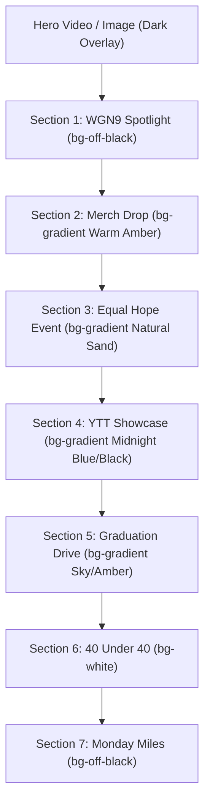
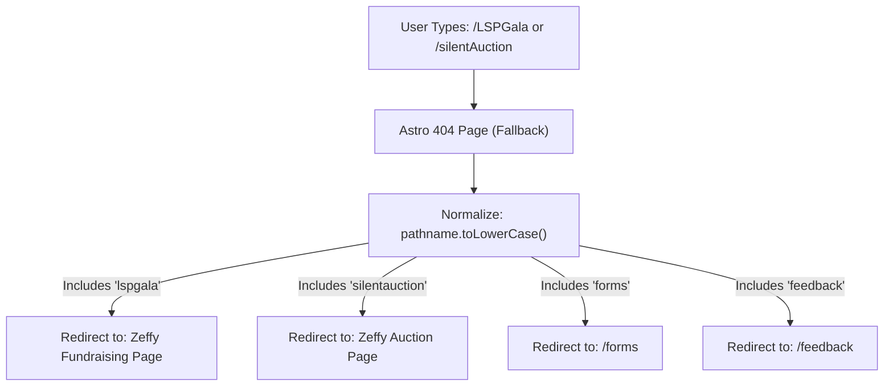

# The Latina Sweat Project — Comprehensive Design Language & Repository Handbook

Welcome to the comprehensive design and architectural handbook for **The Latina Sweat Project** (LSP). This document serves as the absolute single source of truth for the styling patterns, user experience standards, client-side interactions, and repository conventions across the entire digital presence of LSP. 

Use this handbook to maintain visual consistency, optimize mobile-first conversions, and ensure accessibility for every upcoming feature, page, and portal.

---

## 🎨 1. Core Visual Identity & Color System

LSP utilizes a warm, organic, yet highly vibrant color system that celebrates culture, wellness, and movement. The color system is designed to look premium and highly polished, using specific curated tones instead of standard browser colors.

### The Core Color Palette
| Color Token | Hex / Class | Ideal Use Case | Visual Tone |
| :--- | :--- | :--- | :--- |
| **Off-Black** | `#1e1e1e` / `bg-off-black` | Dominant text color, dark mode sections, primary buttons | Modern, grounding, premium |
| **Vibrant Pink** | `#b5a18d` / `text-vibrant-pink` | Primary brand accent, brand headers, active focus states, buttons | Warm, elegant, high-energy |
| **Accent Gold** | `#ffbd59` / `text-accent-gold` | Secondary accent, highlight text, run/miles club badges, warning borders | Energetic, sunny, inviting |
| **Teal** | `text-teal-600` / `bg-teal-600` | Health & wellness collaborations, community safety events | Grounded, calm, medical-community trust |
| **Sky** | `text-sky-500` / `bg-sky-400` | Giving campaigns, donation cards, spring events | Fresh, airy, hopeful |
| **Natural Sand** | `#f5ede3` to `#e8d8c2` | Light section gradients, soft block backgrounds | Grounding, earthy, organic |

### Typography Guidelines
- **Primary Brand Headings**: Font family **Rubik** (or modern high-weight sans-serif like Outfit) with font weight `font-extrabold` or `font-bold` for large titles to create an impactful visual hierarchy.
- **Body Text**: Font family **Inter** or standard premium sans-serif `font-body` with `text-medium-gray` (`text-gray-500` or `text-white/70` in dark sections) to maintain superior readability.

---

## 🔄 2. The Alternating Section Background Pattern (`index.astro` & Shared Layouts)

To create a dynamic visual rhythm and keep users engaged, pages like `src/pages/index.astro` employ an alternating light-and-dark section design pattern. 



### Purpose & Rationale
1. **Visual Cadence**: Breaking up large pages into clear chapters prevents visual fatigue and facilitates scrolling.
2. **Contextual Themes**: The colors are matched to the content. High-energy activities (e.g. running club, active video) are grounded in **Dark** (`bg-off-black`), whereas education, donation, and health initiatives are presented in warm, inviting **Light** background systems.
3. **Optimized Readability**: Alternating layouts forces contrast resets, ensuring the eye is consistently re-focused on the next primary call to action (CTA).

### Standard Code Blueprint for Alternating Sections
When adding a new section, identify whether it belongs in a light or dark theme and use the established tailwind and decorative classes:

#### Option A: Dark Theme (Charcoal / Midnight)
```astro
<section class="relative overflow-hidden bg-off-black py-16 sm:py-20">
  <!-- Glowing Background Blurs to add depth -->
  <div class="absolute -top-32 -left-20 w-[400px] h-[400px] bg-vibrant-pink/15 rounded-full blur-[120px] pointer-events-none"></div>
  
  <div class="relative mx-auto max-w-7xl px-4 sm:px-6 lg:px-8 text-white">
    <!-- Section Content Here -->
  </div>
</section>
```

#### Option B: Warm Natural Theme (Light Sand)
```astro
<section class="relative overflow-hidden bg-gradient-to-br from-[#f5ede3] via-[#ece0cf] to-[#e8d8c2] py-16 sm:py-20">
  <!-- Soft Teal/Gold background blobs -->
  <div class="absolute -top-24 -right-24 w-[420px] h-[420px] bg-teal-300/25 rounded-full blur-[110px] pointer-events-none"></div>
  
  <div class="relative mx-auto max-w-7xl px-4 sm:px-6 lg:px-8 text-off-black">
    <!-- Section Content Here -->
  </div>
</section>
```

---

## 📱 3. The Linktree-esque Social Hub (`src/pages/links.astro`)

The Links page is a crucial portal, housed directly in LSP's social media bios (e.g., Instagram). It is designed to act as an immersive, mobile-first "Linktree" that drives immediate actions like class booking, event signups, and newsletters.

### Bilingual Integration & Content Architecture
All content (titles, descriptions, and badges) inside both the main `links` list and the `highlights` array supports nested `{ en, es }` localization objects.

#### Standard Operating Procedure for Adding New Links
To add, edit, or highlight links, modify the `links` array inside the frontmatter:

```typescript
// Location: src/pages/links.astro
const links = [
  {
    title: {
      en: "📢 Event or Page Title",
      es: "📢 Título del Evento o Página"
    },
    description: {
      en: "Detailed, brief 1-2 sentence description explaining the value proposition.",
      es: "Descripción breve de 1 o 2 oraciones que explique el valor del evento."
    },
    url: `${base}your-target-slug`, // Use base prefix for internal routes, or direct URL for external
    color: "teal", // Options: "teal" | "blue" | "sky" | "wish" | "green" | "indigo" | "amber" | "vibrant-pink" | "gold"
    icon: "calendar", // Options: "calendar" | "heart" | "mind" | "globe" | "star" | "health" | "leaf" | "yoga" | "tv"
    badge: {
      en: "New / Date", // Optional: text string displaying on top-right badge
      es: "Nuevo / Fecha"
    },
    featured: true, // Optional: applies a glowing border, custom shadows, and elevated scaling
  }
];
```

> [!IMPORTANT]
> **The Chronological Ordering Rule:** 
> Links must always be ordered chronologically to ensure maximum community conversion:
> 1. **Upcoming Event/Campaign Links** (with active dates or deadlines) come FIRST.
> 2. **Recurring, Constant, or Undated Links** (e.g., Class Schedule, Main Website, App Downloads) come SECOND.
> 3. **Past Events** must be removed or moved to the bottom of the list.

### Advanced Highlights & Interactive Systems
- **Liquid Glass Language Switcher**: A premium `EN | ES` toggle shifts a liquid glass background indicator dynamically. The toggle manages parent class bindings (`.lang-active-en` / `.lang-active-es`) that swap visible translations in CSS instantly with zero layout shift, and stores preferences in `localStorage`.
- **Branded Story Highlights Covers**: Uses custom, high-fidelity AI-generated covers stored in `public/images/highlights/hl_*.png` (Free Classes, Sponsor, WGN Feature, YTT, Therapy, App).
- **Bubble Sizing and Center Alignment**: 
  - To prevent sizing shifts and squeezing, bubble elements carry absolute sizes (`w-[66px] h-[66px] flex-shrink-0`).
  - The parent list `#highlights-bar` is aligned using `items-start` rather than centering. Since each bubble has identical sizing, **all bubble centers align perfectly horizontally**, regardless of whether their labels underneath span one or two lines.
  - Individual Highlight items apply tailored base scaling factors (`scale-[1.48]`, `scale-[1.38]`, etc.) to crop away any internal margins or outer borders embedded in the graphics, presenting a uniform visual appearance.
- **High-Momentum Direct Routing**: Clicking a Highlight Story bubble routes users directly to external links (e.g. Zeffy drives, REDCap surveys, or television subpages) in a new tab to maximize conversion. Multi-button hubs (Free Classes and App Download) scroll internally to the corresponding page section.
- **Tight Newsletter Spacing**: The embedded Zeffy iframe container `.newsletter-frame` is explicitly styled to `195px` tall to eliminate dead space at the bottom of the card and maintain a clean, compact appearance.
- **Animated Liquid Gradients**: The background is dynamically styled using the `.links-bg` class which rotates a multi-color gradient shifting over 12 seconds (`@keyframes links-gradient-shift`).
- **Floating Decorative Blobs**: Floating organic circles drift slowly in the background (`links-blob-1`, `2`, and `3`) using independent CSS `@keyframes` floats, giving a highly premium, alive feel.
- **Main Hero Promotion (Double Schedule Block)**: Highly prominent free class campaign section split between Pilsen studio (directing users to the schedule page/app) and Southside Social (directing users to Zeffy) to capitalize on immediate conversions.
- **App Download Center**: Clean, branded Google Play and Apple App Store CTA buttons embedded at the bottom using platform SVG logos.
- **Zeffy Newsletter Integration**: Seamlessly embeds the Zeffy sign-up form via a custom styled `iframe` to keep users on-site while gathering contacts.

---

## 🧘‍♀️ 4. The Reels-Style Video Portal (`src/pages/2025ytt.astro`)

The **2025 Yoga Teacher Training (YTT) Cohort page** is a visual showcase that celebrates LSP's certified yoga instructors. It implements a premium, high-fidelity experience optimized for mobile screens, matching the layout language of vertical video platforms (Instagram Reels / TikTok).

### Key Architectural Pillars of the YTT Portal
1. **Interactive Glass Search & Sticky Filters (`.ytt-filterwrap`)**:
   - The filter wrapper remains stuck to the top of the viewport (`position: sticky; top: 0.75rem`).
   - Uses `backdrop-filter: saturate(170%) blur(20px)` and high-contrast translucent borders (`border: 1px solid rgba(255, 255, 255, 0.8)`) to maintain legible content underneath.
   - Search bar input with custom vector search icon and responsive focus shadow (`box-shadow: inset 0 0 0 2px var(--lsp-gold)`).
   - Responsive pill slider: On small mobile screens, the category pills slide horizontally (`overflow-x: auto; scrollbar-width: none`) without clutter, and expand on larger desktop grids.
2. **Reels-Aspect Video Cards (`.ytt-grid` & `.ytt-card`)**:
   - A grid layout that scales seamlessly from 2 columns on mobile devices up to 5 columns on wide desktops.
   - The `.ytt-card` container uses a strict vertical aspect ratio (`aspect-ratio: 9 / 16`) with linear gradients overlaying high-quality thumbnails.
   - **Performance-tuned Loading Animation**: When filters are changed, the cards rise sequentially into view using index-staggered delays (`card.style.animationDelay = ...` mapped to `@keyframes yttRise` translating along the Y-axis).
   - On hover, cards scale outwards (`transform: scale(1.06)`) and expand a custom play overlay button (`.ytt-play`) with glowing shadow indicators.

```
+------------------------------------+
|  [Close]                  [NavUp]  |
|                                    |
|   +----------------------------+   |
|   |   YouTube Programmatic     |   |
|   |         Player             |   |
|   |      (Locked Frame)        |   |
|   |                            |   |
|   |  [Invisible Drag Overlay]  |   |
|   +----------------------------+   |
|                                    |
|   Kayla - Pigeon Pose     [NavDown]|
|   [Swipe up for next]              |
+------------------------------------+
```

3. **Reels-Style Swipe Navigation Lightbox Modal**:
   - Tapping any card opens a full-screen vertical swipe modal (`#ytt-modal`) displaying ~1 minute clips of instructors teaching a pose.
   - **Programmatic YouTube IFrame API**: Programme-controlled player wrapper (`initPlayer`) that handles automatic video playing, destroys old frames instantly, and guarantees that audio stops playing as soon as a user swipes away or closes the modal.
   - **Invisible Drag Overlay (`.ytt-drag-overlay`)**: Positioned directly over the video player frame to intercept mouse drags and touch gestures. This is a critical hack that prevents standard YouTube iframe frames from swallowing touch gestures.
   - **Vertical Swipe/Drag Gesture Track**:
     - Standardizes horizontal locks: Swiping upward loads the next instructor, swiping downward loads the previous instructor, and dragging moves the entire viewport track (`#ytt-modal-track`).
     - Includes a glowing vertical bounce swipe hint overlay (`.ytt-swipe-hint` with `@keyframes yttHintBounce` reading "Swipe for next") that instructs mobile users.
     - **Parent Scroll-Freeze Prevention**: When the modal is open, the page captures the viewport offset (`savedScrollY = window.scrollY`) and applies a locked scroll-freeze state (`body.ytt-modal-open` setting `position: fixed; width: 100%; overflow: hidden`) to prevent background layout shifting. On close, it restores coordinates.

---

## 📊 5. Instagram Stories "Wrapped" Component (`src/pages/wrapped.astro`)

The **2025 Wrapped** page presents a high-impact, story-style retrospective of the year's milestones. It replicates the interaction patterns of Instagram Stories, offering a highly native mobile experience even inside desktop web browsers.

### Key UX Design Features
1. **Mock Phone Viewport Frame**:
   - On mobile viewports, the stories occupy `100vw` and `100vh` for complete immersion.
   - On desktop displays, the player renders a centered mock iPhone enclosure (`w-full h-full lg:w-[375px] lg:h-[812px] lg:max-h-[90vh] lg:rounded-3xl lg:shadow-2xl`) floating over a blurred, scaled-up backdrop of the active slide (`#blurred-bg img` with `blur-3xl scale-110 opacity-50`).
2. **Visual Progress Indicators**:
   - A row of horizontal lines at the top of the container (`#progress-container`), one for each slide.
   - An active progress bar slowly fills over time (`SLIDE_DURATION = 5500` ms) using a CSS `transition-all duration-100` setting width percentages.
   - Fully loaded slides remain at `100%` width, and future slides sit at `0%` width, enabling instant progress scanning.
3. **Tap and Long-Press Gesture Controls**:
   - **Left/Right Tap Zones**: The left 1/3 of the viewport (`#tap-left`) triggers the previous slide, and the right 2/3 (`#tap-right`) triggers the next slide.
   - **Long-Press to Pause**: Holding down a tap zone (`HOLD_THRESHOLD = 200` ms) pauses slide playback and progress bars, and displays a semi-translucent overlay (`#paused-indicator`). Releasing the pointer resumes the experience.

```
       Tap Left (1/3)                Tap Right (2/3)
+-----------------------+---------------------------------------+
|  [Bar 1] [Bar 2] [Bar 3 (Active Progress)] [Bar 4] [Bar 5]    |
|                                                               |
|  <- Swipe/Tap Left                  Swipe/Tap Right ->        |
|  (Previous Slide)                    (Next Slide)             |
|                                                               |
|                        [Hold to Pause]                        |
|                                                               |
+---------------------------------------------------------------+
```

4. **Swipe-Down-to-Close Gesture**:
   - Dragging or swiping downwards anywhere inside the container triggers a native "Swipe to dismiss" action.
   - Using pointer-coordinates, dragging scales the card down (`1 - progress * 0.1`) and reduces opacity (`1 - progress * 0.5`).
   - Dragging past the threshold (`SWIPE_THRESHOLD = 100` px) triggers a slide-down animation (`translateY(100vh)`) and navigates the user back to their previous page, replicating mobile app behaviors.
   - *Note: This gesture is programmatically disabled on the final slide to prevent conflicts with the CTA buttons.*

---

## 🗓️ 6. Dynamic Scheduler & Location Spotlight System (`src/pages/schedule.astro` & `classes.astro`)

The class schedule page is the transactional powerhouse of the site, handling user registrations and booking workflows through MarianaTek integrations.

### Key Visual & Functional Standards
1. **Compact Policy Warning Strip**:
   - Renders a responsive 3-column alert row isolated at the very top of the page:
     - **Age Policy Card (`bg-red-50/70 border-red-200`)**: Standard circular badge (`12+`) enforcing safety registration limits.
     - **Lockout Policy Card (`bg-rose-50/70 border-vibrant-pink/30`)**: Strict notice that doors close exactly 5 minutes after class begins, linking directly to the full late policy (`/latepolicy`).
     - **Cancellation Policy Card (`bg-amber-50/70 border-accent-gold/40`)**: Explicit guidelines detailing email requirements and 30-day billing cycle parameters.
2. **MarianaTek Widget Top Spacing Compensation**:
   - The embedded MarianaTek schedule widget renders native top-padding inside iframe frames that can't be easily overwritten by utility classes.
   - **Architectural Solution**: Wrap the mounting `div` in the custom `.schedule-widget-tight` class, applying a negative margin `margin-top: -0.5rem` and stripping margin/padding child elements to force the widget closer to the troubleshooting menu.
3. **Bilateral Free Class Showcase System**:
   - Renders a visually stunning comparison layout highlighting LSP's community collaborations across two main locations:
     - **Location A (Pilsen LSP Studio)**: Highlights free day rotations, integrates mobile app store download buttons, and displays active class dates.
     - **Location B (Back of the Yards Southside Social)**: Displays the static weekly instructor schedules and provides clear exit CTAs pointing directly to the Zeffy ticketing page.

```
                 Current Real-Time Client Date: May 18, 2026
                                      |
       Pilsen Grid dates:             v             BOTY Grid dates:
+----------------------------+                 +----------------------------+
| [Fri 1] (Past -> Dimmed)   |                 | [Sat 9] (Past -> Dimmed)   |
| [Sat 9] (Past -> Dimmed)   |                 | [Sun 10] (Past -> Dimmed)  |
| [Sun 17] (Past -> Dimmed)  |                 | [Sat 16] (Past -> Dimmed)  |
|                            |                 |                            |
| [Mon 25] <--- ACTIVE NEXT  |                 | [Sat 23] <--- ACTIVE NEXT  |
|              (Glows Gold)  |                 |             (Glows Emerald)|
|                            |                 |                            |
| [Tue 2]  (Future -> Clean) |                 | [Sun 24] (Future -> Clean) |
+----------------------------+                 +----------------------------+
```

4. **Dynamic Real-Time "NEXT" Class Highlighting Script**:
   - Displays calendar dates in static HTML grids. To keep these dates from feeling stale, a client-side JavaScript engine executes instantly upon loading.
   - **The Highlight Logic**: 
     - Parses the current calendar date (`new Date()`) and normalizes it to a `YYYY-MM-DD` string.
     - Groups elements carrying `data-free-date` and `data-free-loc` attributes.
     - Sorts each group chronologically, compares strings against `todayStr`, and tags the *very first* event that is equal to or greater than the current date with the `data-free-next="true"` attribute.
     - **High-contrast CSS Styles**: Elements matching `data-free-next="true"` automatically display a styled `↓ NEXT` label badge and animate a glowing ambient pulse shadow (`@keyframes sched-pulse-gold` and `@keyframes sched-pulse-emerald`), instantly guiding the user to the next upcoming free class.

---

## 💬 7. Bilingual Collapsible Accordion System (`src/pages/faq.astro`)

The FAQ page handles core membership, cost, and logistics questions in a highly visual, fully translation-friendly bilingual layout.

### Layout & Sizing Standards
1. **Bilingual Side-by-Side Cards**:
   - The mission introduction displays a dual grid: "Hecha por Latinas" (English column) and "Para Nuestra Comunidad" (Spanish column).
   - Styled with soft background translucency (`bg-white/[0.04] backdrop-blur-sm`) and thin top-border linear highlights (`bg-gradient-to-r from-transparent via-accent-gold/pink to-transparent`) to establish immediate brand warmth.
2. **Smooth Height-Expanding Accordion (`.faq-item`)**:
   - Accordion answers utilize a strict `overflow: hidden; max-height: 0; transition: max-height 0.4s cubic-bezier(0.4, 0, 0.2, 1)` standard.
   - When a user toggles a question, the class `.open` is appended, expanding `max-height` smoothly to `600px` and rotating the vector chevron toggle icon (`.faq-chevron`).
   - The client-side script enforces a **Single-Open Rule**: Toggling any new FAQ immediately sweeps the list and closes all other open cards to keep scroll offsets compact. The first FAQ card is set to `.open` by default upon page initialization.
3. **Bilingual Inline Tab Switcher**:
   - Each FAQ item contains individual inline language switchers (`.lang-btn`).
   - Tapping "Español" dynamically hides the English div (`.lang-en`) and displays the Spanish div (`.lang-es`) by toggling the Tailwind `.hidden` utility class via client-side JS selectors. This allows multilingual users to read answers in their preferred language without forcing a heavy global page reload.

---

## 📈 8. Live Event Fundraising Dashboard (`src/pages/gala/live.astro` & `gala.astro`)

For fundraisers and gala events, LSP utilizes an immersive, high-contrast live visual theater designed to be displayed on stage projectors or primary event monitors.

### Aesthetic Elements & Layout
- **Strict Viewport Containment**: Renders using `lg:h-screen lg:overflow-hidden bg-off-black`, keeping all crucial components visible on the main stage screen without generating a vertical scrollbar.
- **Top 10% / Middle 80% / Bottom 10% Division**:
  - **Header (10% h)**: Sleek, narrow border container displaying the branding logo and the event title "Noche Inolvidable" in wide uppercase typography.
  - **Main Stage (80% h)**: Splits down the middle on desktop screens:
    - **Left Column**: Displays a reactive live Svelte thermometer widget (`Thermometer client:only="svelte"`) mapping fundraising progress, and a real-time leaderboard listing top donation names (`TopDonors`).
    - **Right Column**: Centers a large, glowing fundraising QR code (`galaqr.png`) encased inside a thick, multi-color pulsing neon shadow block (`animate-pulse blur-lg bg-gradient-to-r from-vibrant-pink via-accent-gold to-vibrant-pink`).
  - **Footer Ticker (10% h)**: Stays fixed at the bottom edge (`fixed bottom-0 left-0 right-0`), running a horizontal reactive donation marquee loop (`DonationTicker`) and generating slide-up overlay cards (`DonationPopup`) whenever a new Zeffy donation is completed.

```
+---------------------------------------------------------------+
|                      Header (Logo & Title)                    |
+-------------------------------+-------------------------------+
|                               |                               |
|        Left Column:           |         Right Column:         |
|                               |                               |
|     [Svelte progress          |     [Pulsing Glow QR Code]    |
|       thermometer]            |           "Scan Me"           |
|                               |                               |
|     [Live Donor Standings]    |      latinasweatproject.com   |
|                               |                               |
+-------------------------------+-------------------------------+
|                      Footer Donation Ticker                   |
+---------------------------------------------------------------+
```

- **GPU-Accelerated Floating Particles System**:
  - Creates a three-dimensional depth effect using two distinct particle keyframe sets:
    - **Gold Particles (`.particle-gold`)**: Move vertically from the bottom of the screen (`transform: translateY(100vh) scale(0)`) up to the top using a linear keyframe path (`@keyframes float-up`).
    - **Pink Particles (`.particle-pink`)**: Drift diagonally across the canvas using a secondary coordinate path (`@keyframes float-diagonal`).
  - **Performance Optimization**: Particles are isolated using `pointer-events-none z-0` and are programmatically hidden on narrow mobile devices (`hidden lg:block`) to prevent CPU bottlenecks on mobile viewports.
  - **Soft Ambient Pulsing**: Slow-moving radial gradients (`ambient-glow`) slowly pulse in scale and opacity in the background over 8 seconds (`@keyframes ambient-pulse`) to create a warm, alive backdrop without distracting from the text.

---

## 🤝 9. Svelte Portals & Policy Notice Frameworks (`shifts.astro`, `subs.astro`, `discountmembership.astro`, `elections.astro`)

For public community portals that handle volunteer shifts, teacher sub-requests, sliding scale packages, and board elections, LSP employs a hybrid architecture: fast Astro layout frames wrapping reactive, client-mounted Svelte engines.

### Policy Notice Standards
To establish immediate community boundaries, reduce administrative friction, and handle known browser bugs, all interactive portals must mount warning grids using these three standardized card styles:

```
+-----------------------------------------------------------------+
|  [Known iOS Safari Warning] - bg-red-50 border-red-200          |
|  - Advises users of viewport issues, requests desktop switch   |
+-----------------------------------------------------------------+
|  [Children Safety Policy] - bg-amber-50 border-amber-200        |
|  - Warns volunteers not to bring kids to shifts for safety     |
+-----------------------------------------------------------------+
|  [Process/Checklist Rules] - bg-blue-50 border-blue-200          |
|  - Outlines consecutive hour tracking and lead check-in rules   |
+-----------------------------------------------------------------+
```

1. **Option A: Known iOS Safari Warning (`bg-red-50 border-red-200 text-red-800`)**:
   - Enforces a critical warning to prevent mobile layout errors on iPhone devices, prompting users to switch to "Desktop View" or use a computer.
2. **Option B: Children Safety Notice (`bg-amber-50 border-amber-200 text-amber-800`)**:
   - Important mutual-aid safety card advising volunteers that bringing children to shifts is strictly prohibited for focus and liability reasons.
3. **Option C: Process / Checklist Rules (`bg-blue-50 border-blue-200 text-blue-800`)**:
   - Helpful guide detailing consecutive hours, checkout requirements, and maximum daily hour limits before Svelte forms initialize.
4. **Candidate Speeches & Modals Grid (`elections.astro`)**:
   - Features standard congratulatory banners coupled with embedded YouTube recordings of candidate speeches.
   - Loops candidate data arrays to render the custom `<CandidateCard />` grid, displaying detailed bios, images, and card story modals.

---

## 🔒 10. Admin Dashboard Blueprint & Security Guidelines

To manage check-ins, verify elections, track gala tickets, and audit volunteer hours, LSP uses a standard Astro-Svelte admin framework under `/src/pages/admin/` or as `*admin.astro` pages.

### The 4-Tier Admin Architecture
Every administrative tool must implement these four distinct functional layers:

#### Tier 1: Astro Layout Frame
Admin pages wrap content in standard layouts but strip the main footer (`hideFooter={true}`) to preserve clean dashboard layouts:
```astro
<Layout title="Volunteer Hour Audit | The Latina Sweat Project" hideFooter={true}>
  <main class="min-h-screen bg-slate-50">
     ...
  </main>
</Layout>
```

#### Tier 2: The Svelte Mounting Point
All reactive interfaces, CSV data parsers, and API integrations are handled inside Svelte. The component is mounted in client-only mode to prevent node hydration discrepancies during server rendering:
```astro
<VolunteerHourAuditApp client:only="svelte" />
```

#### Tier 3: Known iOS Layout Warning Banner
Include the standard red warning banner (`bg-red-50 border-red-200`) at the top of the markup to intercept mobile admin layouts.

#### Tier 4: Client-Side Password Gate & Session Storage
For quick security control without complex backend authorization, implement the standard client-side authentication gate script:
```html
<!-- Gate Box (Displays by default) -->
<div id="password-gate" class="flex items-center justify-center min-h-screen">
  <!-- Interactive Form Card -->
</div>

<!-- Dashboard Box (Hidden by default) -->
<div id="admin-dashboard" class="hidden">
  <VolunteerHourAuditApp client:load />
</div>

<script>
    const ADMIN_PASSWORD = "YourSecurePassword!"; 
    const passwordGate = document.getElementById("password-gate");
    const adminDashboard = document.getElementById("admin-dashboard");
    
    // Auto-login if session token is active
    if (sessionStorage.getItem("adminAuth") === "true") {
        showDashboard();
    }
    
    function showDashboard() {
        passwordGate?.classList.add("hidden");
        adminDashboard?.classList.remove("hidden");
    }
    
    // Validate input...
    if (userInput === ADMIN_PASSWORD) {
        sessionStorage.setItem("adminAuth", "true");
        showDashboard();
    }
</script>
```

---

## 📝 11. Google-Backed Custom Feedback Form (`src/pages/feedback.astro`)

The `/feedback` page is a custom LSP-branded student feedback form that submits into the existing Google Forms backend while keeping the visitor on the Latina Sweat Project website. It should feel like a native LSP page, not an embedded Google form.

### Visual Structure
- **Header Frame**: Uses the standard `<Layout />` and `<Header />` stack so global SEO, navigation, analytics, and footer behavior remain consistent.
- **Dark Intro Band**: Opens with `bg-off-black`, a small uppercase `text-accent-gold` eyebrow, and a large Rubik hero headline. This follows the dark/light contrast cadence from the broader site while keeping the page focused and operational.
- **Warm Sand Form Section**: The main body uses `#f5ede3` as the page background with a white form panel, restrained `8px` radii, subtle sand borders, and high-legibility Rubik form controls.
- **Support Sidebar**: A sticky dark sidebar explains what kind of feedback is most useful. It uses accent-gold left borders rather than large decorative graphics so the page remains compact and task-oriented.

### Google Forms Backend Contract
The form posts directly to the published Google Forms `formResponse` endpoint through a hidden iframe target. This avoids navigating the user away from the website after submission.

```txt
POST https://docs.google.com/forms/u/0/d/e/1FAIpQLSeaDvWmhbB8zurAcAHfgPIy5Q2BZwEAjfokmvSqWFoAAkvWgQ/formResponse

Day of class: entry.76550844
Time hour: entry.597003498_hour
Time minute: entry.597003498_minute
Studio location: entry.1359628243
Instructor's name: entry.1307649976
Suggestions / constructive feedback: entry.1108185089
Community team contact preference: entry.1074384446
Contact information: entry.1082735490
```

### Interaction Rules
1. The visible time control is a native `<input type="time">`; client-side JavaScript splits it into Google Forms' required hour and minute hidden fields.
2. Contact information becomes required only when the visitor selects "Yes" or "Maybe" for community team follow-up.
3. Submission status is announced through an `aria-live` status box and the submit button is disabled while the hidden iframe post is in flight.
4. Do not submit dummy data to the live Google Form during QA. Validate the payload locally by reading form controls or by intercepting submit before network transmission.
5. If the Google Form is edited, re-inspect the live form and update both the action URL and every `entry.*` field name in `src/pages/feedback.astro` and this handbook.

### Navigation Exposure
- **Desktop Header**: `/feedback` appears as the topmost highlighted row in the `More` dropdown. It should not be placed in the top-level header action cluster because the desktop header is already dense with account, donation, and booking CTAs.
- **Mobile Navigation**: `/feedback` appears immediately after Classes as an accent-gold "After class / Share Feedback" action block so students can find it quickly after a class experience.
- **Footer Newsletter Area**: `/feedback` appears below the newsletter signup embed as an accent-bordered "After class / Share Feedback" card. Keep it out of the footer Navigation list so it reads like a purposeful post-class CTA instead of another utility route.
- **Shared Nav Data**: `src/data/nav.js` includes `/feedback` so any future data-driven navigation surfaces inherit the route.
- **404 Redirect Engine**: `/feedback` is also represented in `src/pages/404.astro`, so mixed-case public links such as `/Feedback` or `/FEEDBACK` still resolve.

---

## 🔗 12. Silent Case-Insensitive Redirections Engine (`404.astro`)

Because physical flyers and social bios are susceptible to casing discrepancies (e.g. `/LSPgala` vs `/lspgala`), the 404 page acts as an intelligent redirect engine.



### The Redirect Script
The engine is written in standard vanilla JavaScript inside a client-side `<script>` block in `src/pages/404.astro`:

```html
<script>
    // 1. Grab pathname and normalize casing immediately
    const path = window.location.pathname.toLowerCase();
    
    // 2. Perform includes checks and redirect to target URL
    if (path.includes("lspgala")) {
        window.location.href = "https://www.zeffy.com/en-US/donation-form/latina-sweat-project-gala-fundraising";
    } else if (path.includes("silentauction")) {
        window.location.href = "https://www.zeffy.com/en-US/ticketing/latina-sweat-project-gala-silent-auction";
    } else if (path.includes("galaraffle")) {
        window.location.href = "https://www.zeffy.com/en-US/ticketing/latina-sweat-project-gala-raffle";
    } else if (path.includes("marketing")) {
        window.location.href = "https://sites.google.com/gosuperdope.com/brandhq/home";
    } else if (path.includes("intake")) {
        window.location.href = "https://docs.google.com/forms/d/e/.../viewform";
    } else if (path.includes("forms")) {
        window.location.href = "/forms"; // Internal route redirect
    } else if (path.includes("feedback")) {
        window.location.href = "/feedback"; // Internal route redirect
    }
</script>
```

> [!TIP]
> **Best Practice for Marketing Campaigns:**
> When launching a new physical flyer with a short URL:
> 1. Do **not** create a dedicated routing rule in the hosting configuration.
> 2. Simply add a new `else if (path.includes("your-campaign"))` redirect inside `404.astro`.
> 3. This guarantees the URL is case-insensitive, highly resilient, and redirects instantly.
> 4. When creating a new page in `src/pages/`, add a matching case-insensitive `404.astro` redirect whenever the URL may appear on flyers, social bios, QR codes, texts, or spoken instructions.

---

## 🧠 13. Project Memory & Change Record Rules

Treat `design.md` as the durable memory for the website's design system, structure, third-party integrations, and routing conventions.

1. **Always Update This Handbook**: Any change to a website page, layout, component, public route, embedded form, third-party backend integration, navigation surface, or major visual pattern must include a corresponding `design.md` update in the same work session.
2. **Record Functional Contracts**: When adding forms, iframes, redirects, APIs, analytics events, or external services, document the endpoint, important field IDs, required hidden inputs, and QA expectations.
3. **Record Visual Decisions**: When adding a new page or major section, document the color theme, layout structure, responsive behavior, and any special interaction rules.
4. **Use `404.astro` for Case-Insensitive Public Links**: New public pages and campaign links must be considered for `src/pages/404.astro` routing so mixed-case URLs like `/Feedback`, `/FEEDBACK`, or flyer variants still land correctly.
5. **Keep This File Current Over Perfect**: A concise but accurate update is better than leaving undocumented drift.

---

## 🚀 14. Summary checklist for Future Developers

When modifying or expanding the website, adhere strictly to these principles:
- **Never use plain color placeholders**: Always match elements to the brand's HSL/Hex token schemes.
- **Maintain the Alternating Background Cadence**: Keep the rhythmic light/dark layout transitions when building long homepage flows.
- **Maintain Vertical Video Experience Quirks**: When working with iframe overlays in portals like `2025ytt.astro`, always insert a programmatic `.ytt-drag-overlay` to catch drag events.
- **Maintain Visual Mobile Framing on Desktop**: When creating immersive, storytelling slides (`wrapped.astro`), use absolute background blurs overlayed by clear device-proportional frames on wide viewports.
- **Update `design.md` With Every Website Change**: This handbook is the project's memory; keep it synchronized with the actual site.
- **Use the 404 Redirect Engine**: Rather than implementing expensive backend routing redirects, append public-page and campaign redirect queries to `src/pages/404.astro` so links resolve case-insensitively.
- **Keep Admin Dashboards Lightweight**: Frame dashboards in Astro, but do the heavy lifting in Svelte components utilizing `client:only="svelte"` for maximum client-side performance.
